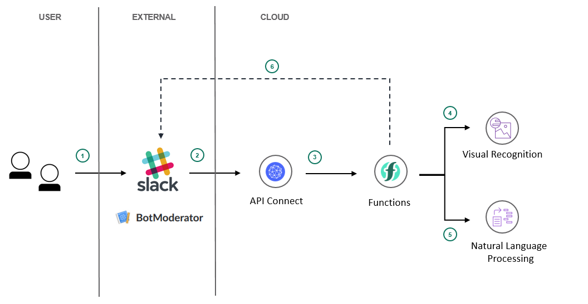

# Create a cognitive moderator chatbot for anger detection, natural language understanding and explicit images removal
In this developer journey, we will create a chatbot using IBM Functions and Watson Services. 
The Assistant flow will be enhanced by using Natural Language Understanding to identify entities and using Tone Analyzer to detect customer emotions. For FAQs, a call to the Discovery service will use passage retrieval to pull answers from a collection of documents.

When the reader has completed this journey, they will understand how to:

* Create a chatbot that integrates with Slack via IBM Functions
* Use Watson Visual Recognition to detect explicit images (in beta)
* Use Watson Tone Analyzer to detect emotion in a conversation
* Identify entities with Watson Natural Language Understanding

## Flow
